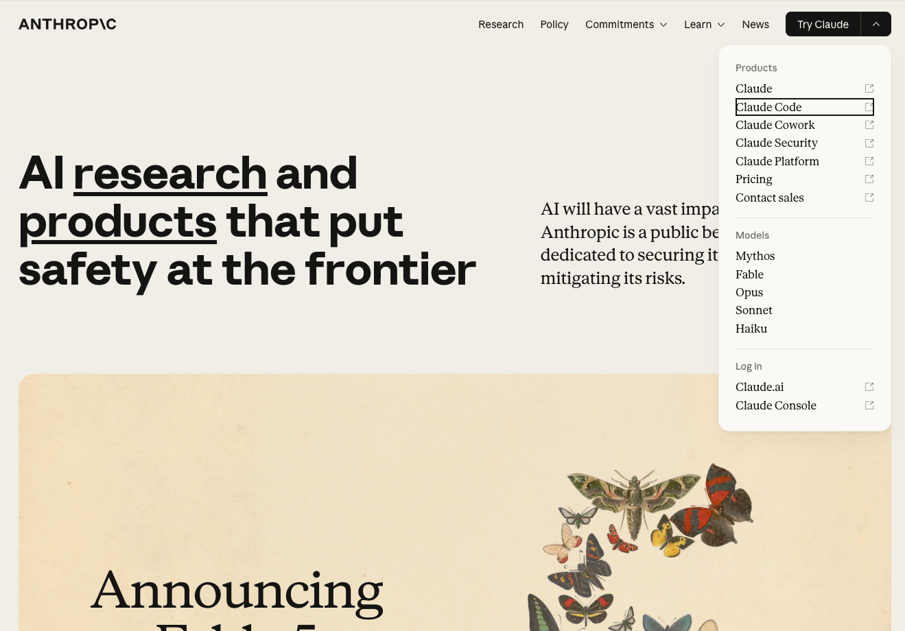

<!-- _class: lead -->
<!-- _paginate: false -->

# Bloque 0
## Bienvenida y Contexto

Taller **Applied AI**

---

## Agenda del día

| Bloque | Tema | Duración |
|--------|------|----------|
| **0** | Bienvenida y contexto | 15 min |
| **1** | Prompt Engineering | 45 min |ara
| **2** | Claude Cowork / Code | 45 min |
| **3** | Claude SDK | 45 min |

Entre cada bloque haremos un descanso de 5 minutos.

---

<!-- _paginate: false -->

## Sobre mí

**Sergio Soto Núñez**
AI Engineer @ <a href="https://diverger.ai/" target="_blank">Diverger.ai</a>

Ingeniero de IA con experiencia en LLMs, agentes y aplicaciones empresariales.
Ayudo a equipos a integrar IA generativa en sus flujos de trabajo.

🏅 Anthropic CCAF — Claude Certified Architect: Foundations

🔗 <a href="https://linkedin.com/in/sergiosotonunez" target="_blank">linkedin.com/in/sergiosotonunez</a> · ✉️ sergiosotonunez@gmail.com

---

## ¿Por qué Applied AI ahora?

- Los LLMs pasaron de **laboratorio** a **producción** en tiempo récord
- Las herramientas son accesibles sin infraestructura propia — aunque las suscripciones tienen coste real: **claude.ai Pro** (~$20/mes), **Claude Code** (~$100/mes), **API** de pago por uso
- El diferencial ya no es el modelo, sino **cómo lo usas**

> La IA aplicada no es una tendencia futura — es una habilidad presente.

---

## Qué veremos hoy

- **Prompt Engineering** — comunicarte con el modelo de forma efectiva
- **Claude Cowork / Code** — flujos reales con y sin código
- **Claude SDK** — construir tu primer agente funcional

Saldrás con **conocimiento práctico** y herramientas listas para usar.

---

## Configuración y presentaciones

- **<a href="https://anthropic.com/" target="_blank">anthropic.com</a>** — instalar Claude Desktop y Claude Code
- **Licencia Claude Pro**: suficiente para el taller y empezar a usar las herramientas. El coste son $17 (~20€).
- **Ronda de presentaciones**: objetivos y espectativas

---

<!-- _class: lead -->

# ¡Empecemos! 🚀

Cualquier pregunta, interrúmpeme cuando quieras

[← Volver al índice](index.html)
