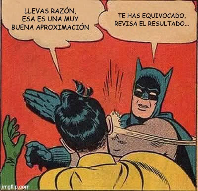

<script>
(function () {
  function inject() {
    const osc = document.querySelector('.bespoke-marp-osc');
    if (!osc || osc.querySelector('#home-btn')) return;
    const btn = document.createElement('a');
    btn.id = 'home-btn';
    btn.href = 'index.html';
    btn.title = 'Volver al inicio';
    btn.textContent = '⌂';
    btn.style.cssText = 'opacity:.8;cursor:pointer;font-size:2.4em;color:inherit;text-decoration:none;padding:0 4px;transition:opacity .2s';
    btn.onmouseenter = () => btn.style.opacity = '1';
    btn.onmouseleave = () => btn.style.opacity = '.8';
    osc.appendChild(btn);
  }
  if (document.readyState === 'loading') {
    document.addEventListener('DOMContentLoaded', inject);
  } else {
    inject();
  }
})();
</script>

<!-- _class: lead -->
<!-- _paginate: false -->

# Bloque 1
## Prompt Engineering

Patrones · Antipatrones · Ejercicio práctico

---

## ¿Qué es un prompt?

Un **prompt** es la instrucción que le das al modelo para obtener una respuesta.

La calidad del output depende directamente de la **claridad y estructura** del input.

> "Garbage in, garbage out" — aplica igual a los LLMs.

---

## ¿Qué hay detrás del asistente?

Un **LLM** (Large Language Model) es un modelo estadístico entrenado para predecir la continuación más probable de un texto.

No "entiende" — **completa patrones** aprendidos de billones de palabras.

Esto explica tres cosas clave:

- **Sin memoria por defecto** — cada conversación empieza desde cero
- **Respuesta probable, no verdadera** — el modelo elige lo más plausible, no lo correcto
- **Sensible al contexto** — un prompt ambiguo abre el espacio de respuestas posibles → output genérico

> El asistente no te lee la mente. Te lee el prompt.

---

<!-- _class: lead -->

## Caso práctico: NomadHub

Startup de espacios de coworking.
Acaban de abrir su **tercer espacio nuevo**.

Necesitan comunicarlo.

Usaremos este caso en **todos los ejemplos** de este bloque.

---

## El mismo objetivo. Dos iteraciones.

**Iteración 1** — explorar rápido

```
Escríbeme un email para anunciar la apertura.
```

El output llega, pero es genérico. Eso no es un fracaso: es información. ¿Qué falta?

**Iteración 2** — añadir estructura *(lo construiremos juntos)*

```
Eres el responsable de marketing de NomadHub, una startup de
coworking para nómadas digitales. Acabamos de abrir nuestro
tercer espacio en Málaga. Redacta un email de apertura para
nuestra lista de suscriptores con asunto, cuerpo de máximo
150 palabras y CTA final. Tono cercano. Sin palabras como
"innovador" o "disruptivo".
```

---

## Patrones de prompt

En ingeniería del software, un **patrón de diseño** es una solución reutilizable a un problema recurrente — no es código concreto, es una plantilla de pensamiento.

Lo formalizaron Gamma, Helm, Johnson y Vlissides en *Design Patterns* (1994): Factory, Observer, Strategy...

**La misma idea aplica aquí.**

Un patrón de prompt es una estructura reutilizable que resuelve un problema recurrente al comunicarse con un LLM.

No es una fórmula mágica — es un punto de partida que puedes adaptar.

---

## Patrón 0 — Intención antes que instrucción

Un LLM siempre genera algo. Y lo genera rápido.

El riesgo no es que no responda — es que respondas a la pregunta equivocada con mucho detalle.

Antes de abrir el chat, responde esto:

- ¿Qué problema estoy resolviendo **realmente**?
- ¿Qué aspecto tiene un output que me sirva?
- ¿Necesito generarlo ahora, o necesito pensarlo primero?

> Velocidad sin dirección es ruido. El prompt empieza antes de escribir el prompt.

---

## Patrón 1 — Rol

Sin rol, el modelo elige una perspectiva genérica.

```
Eres el responsable de marketing de NomadHub,
una startup de coworking para nómadas digitales.
```

**Por qué importa:** el modelo calibra vocabulario, tono y nivel de detalle según el rol que le asignas.

---

## Patrón 2 — Contexto

Sin contexto, el modelo asume. Y asume mal.

```
Acabamos de abrir nuestro tercer espacio en Málaga,
enfocado a nómadas digitales y equipos remotos.
```

**Por qué importa:** el contexto elimina ambigüedad y reduce alucinaciones sobre hechos de tu negocio.

---

## Patrón 3 — Tarea específica

```
Redacta un email de apertura
para nuestra lista de suscriptores.
```

❌ `"Ayúdame con el lanzamiento"` — ¿qué canal? ¿qué acción? ¿para quién?

✅ Una tarea = una instrucción clara y acotada.

---

## Patrón 4 — Formato de salida

Sin formato definido, el modelo decide por ti.

```
Estructura:
- Asunto del email
- Cuerpo (máximo 150 palabras)
- CTA final con enlace
```

**Por qué importa:** te ahorra reformatear el output y hace el resultado directamente utilizable.

---

## Patrón 5 — Restricciones explícitas

Decirle al modelo qué **no** quieres es tan importante como lo que sí quieres.

```
Tono cercano y directo.
Evita palabras como "innovador", "disruptivo" o "ecosistema".
No uses signos de exclamación en el asunto.
```

**Por qué importa:** sin restricciones, el modelo tiende a lo genérico y al lenguaje corporativo vacío.

---

## Patrón 6 — Few-shot (ejemplo de referencia)

Mostrar es más eficaz que describir.

```
Aquí tienes un email anterior que funcionó bien.
Usa un tono y estructura similares:

---
Asunto: Ya estamos en Barcelona. Y tenemos mesa para ti.
Hola [nombre], el coworking que pedíais en Barcelona ya existe...
---
```

**Por qué importa:** un ejemplo vale más que tres párrafos describiendo el estilo de marca.

---

## Repaso — Los 7 patrones

| # | Patrón | Clave |
|---|--------|-------|
| 0 | **Intención** | Para. ¿Qué necesitas realmente? |
| 1 | **Rol** | Quién eres al escribir |
| 2 | **Contexto** | Qué sabe el modelo de tu negocio |
| 3 | **Tarea específica** | Qué quieres exactamente |
| 4 | **Formato de salida** | Cómo debe estructurarse la respuesta |
| 5 | **Restricciones** | Qué **no** quieres |
| 6 | **Few-shot** | Un ejemplo vale más que mil palabras |

---

## El prompt completo — 1/3

```
[Patrón 1 · Rol]
Eres el responsable de marketing de NomadHub,
una startup de coworking para nómadas digitales.

[Patrón 2 · Contexto]
Acabamos de abrir nuestro tercer espacio en Málaga.
```

---

## El prompt completo — 2/3

```
[Patrón 3 · Tarea]
Redacta un email de apertura para nuestra lista de suscriptores
con esta estructura:

[Patrón 4 · Formato]
- Asunto
- Cuerpo (máximo 150 palabras)
- CTA con enlace a la web
```

---

## El prompt completo — 3/3

```
[Patrón 5 · Restricciones]
Tono cercano y directo.
Sin palabras como "innovador" o "disruptivo".

[Patrón 6 · Few-shot]
Aquí tienes un email anterior como referencia de tono:
"Asunto: Ya estamos en Barcelona. Y tenemos mesa para ti. [...]"
```

---

<style scoped>
section { font-size: 0.9996em; }
</style>

## Chain-of-Thought — cuándo usarlo

Cuando la tarea tiene **múltiples pasos** o requiere razonamiento, pide al modelo que piense antes de responder.

```
Antes de redactar el email, razona:
1. ¿Qué sabe el suscriptor de NomadHub?
2. ¿Qué hace diferente el espacio de Málaga?
3. ¿Qué acción concreta queremos que tome?

Luego redacta el email.
```

**Resultado:** el modelo explicita sus asunciones antes de escribir — más fácil de corregir si algo falla.

> **Con modelos razonadores**, el CoT ocurre internamente de forma automática — no hace falta pedirlo. Guiar los pasos sigue siendo útil para acotar el razonamiento.

---

## Antipatrón 1 — El prompt ambiguo

Tomamos el email generado y pedimos:

```
Hazlo más atractivo.
```

❓ ¿Más atractivo para quién? ¿Más visual? ¿Más emocional? ¿Más corto?

✅ En su lugar:
```
Reescribe el asunto para aumentar la tasa de apertura.
Usa una pregunta o una afirmación inesperada. Máximo 8 palabras.
```

---
<style scoped>
section { font-size: 0.9996em; }
</style>

### Antipatrón 2 - [El "Yes-man"](https://www.mariiapetryk.com/blog/post-23-yes-man-and-other-people-pleasing-behavior-of-llms)



El modelo por defecto completa lo que pides sin cuestionarlo.

```
Redacta el email de apertura de Málaga.
```

✅ Añade una instrucción de crítica previa:
```
Antes de redactarlo, señala cualquier información que te falte
o asunción que estés haciendo sobre NomadHub o el público objetivo.
```

**Resultado:** el modelo te avisa antes de inventarse datos de tu negocio.

---

## Antipatrón 3 — La tarea gigante

```
Crea toda la campaña de lanzamiento del espacio de coworking.
```

El modelo genera algo. Pero no es lo que necesitabas.

✅ Descompón en pasos:
```
Paso 1: Email de apertura para suscriptores
Paso 2: 3 posts para LinkedIn e Instagram
Paso 3: Email de seguimiento para quienes no abrieron el primero
```

Cada paso usa el output del anterior como contexto.

---

## Antipatrón 4 — Olvidar el público

El mismo hecho. Dos audiencias. Dos prompts distintos.

```
[Para usuarios finales]
Email de apertura: tono cercano, beneficios concretos,
CTA para reservar un día de prueba gratuito.

[Para inversores]
Email de apertura: enfocado en tracción, tercer espacio en 18 meses,
métricas de ocupación, próximos mercados objetivo.
```

**El modelo no sabe para quién escribes si no se lo dices.**

---

## La plantilla

```
Rol:           Eres [X] con experiencia en [Y]
Contexto:      [situación actual del negocio]
Tarea:         [qué necesito exactamente]
Formato:       [estructura y extensión de la respuesta]
Restricciones: [qué no quiero / límites de tono o contenido]
Referencia:    [ejemplo de output que te gusta]
```

Guárdala. Reutilízala. Mejórala con cada uso.

---

## Ejercicio práctico

**Tu turno** — Aplica la plantilla a un caso real de tu startup.

Elige una tarea concreta:
- Un email a clientes
- Un post para RRSS
- Una respuesta a una objeción de ventas
- Una descripción de producto

5 minutos para escribir el prompt → pruébalo en claude.ai → compartimos.

---

<!-- _class: lead -->

# Pausa — 5 minutos

Continuamos con el Bloque 2.

[← Volver al índice](index.html)
