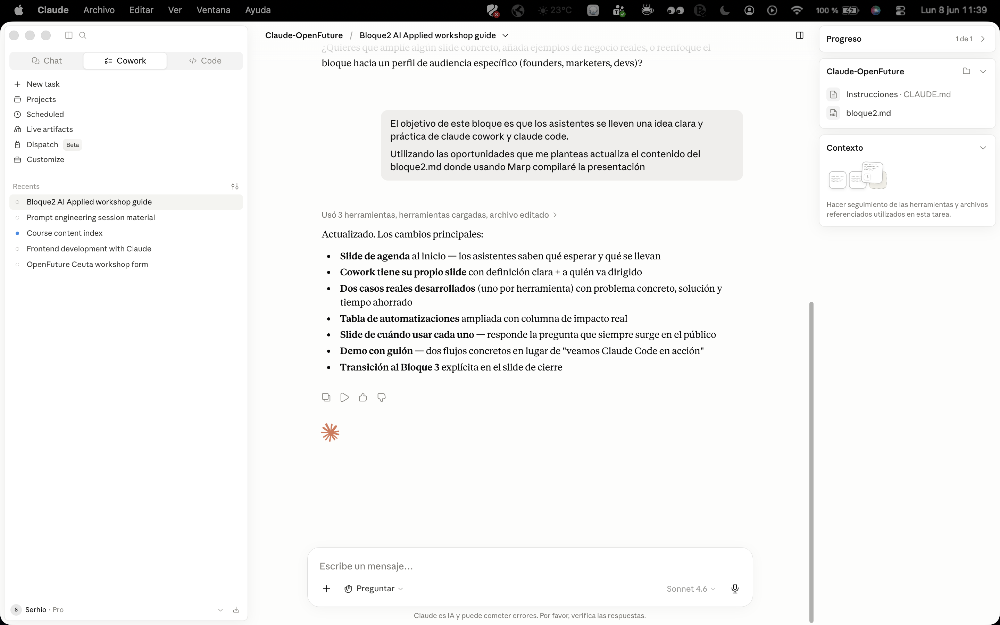
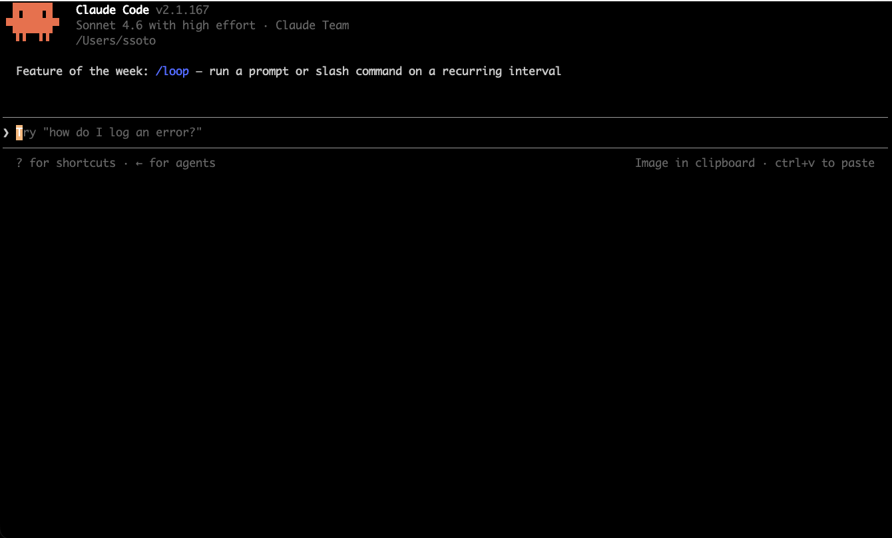

<script>
(function () {
  function inject() {
    const osc = document.querySelector('.bespoke-marp-osc');
    if (!osc || osc.querySelector('#home-btn')) return;
    const btn = document.createElement('a');
    btn.id = 'home-btn';
    btn.href = 'index.html';
    btn.title = 'Volver al inicio';
    btn.textContent = '⌂';
    btn.style.cssText = 'opacity:.8;cursor:pointer;font-size:2.4em;color:inherit;text-decoration:none;padding:0 4px;transition:opacity .2s';
    btn.onmouseenter = () => btn.style.opacity = '1';
    btn.onmouseleave = () => btn.style.opacity = '.8';
    osc.appendChild(btn);
  }
  if (document.readyState === 'loading') {
    document.addEventListener('DOMContentLoaded', inject);
  } else {
    inject();
  }
})();
</script>

<!-- _class: lead -->
<!-- _paginate: false -->

# Bloque 2
## Claude Cowork & Claude Code

Dos herramientas · Un objetivo · Automatizar tu trabajo real

---

## ¿Qué vamos a ver?

1. **Claude Cowork** — la IA integrada en tu escritorio, sin código
2. **Claude Code** — la IA como agente de desarrollo en tu terminal
3. **Automatizaciones reales** — casos que ya funcionan en producción
4. **Demo en vivo** — lo vemos juntos

> Al final de este bloque sabrás cuál usar y cómo empezar hoy.

---

## Claude Cowork — IA en tu escritorio

<style scoped>
section { font-size: 0.99995em; }
</style>


**Claude Cowork** es la app de escritorio que conecta Claude con tus archivos, carpetas y flujos de trabajo:

- Accede a tus documentos y los procesa directamente
- Ejecuta tareas multi-paso: leer → analizar → generar → guardar
- **Projects**: contexto persistente — Claude "recuerda" tu proyecto entre sesiones
- Sin código. Sin APIs. Sin configuración técnica.

**Para quién:** cualquier persona del equipo — marketing, operaciones, producto, ventas.

---

## Cowork en la práctica — Caso real

**Problema:** una startup recibe decenas de propuestas de partners al mes en PDF. Revisarlas consume días del equipo.

**Con Cowork:**

1. Arrastra los PDFs a la sesión
2. Prompt: *"Extrae nombre, propuesta de valor y modelo de ingresos de cada documento"*
3. Claude genera una tabla comparativa lista para decisión

> No es magia — es definir bien la tarea y dejar que Claude la ejecute.

---

## Claude Code — IA como agente de desarrollo

<style scoped>
section { font-size: 0.99995em; }
</style>


**Claude Code** es una CLI que convierte Claude en un agente que opera dentro de tu repositorio:

```bash
npm install -g @anthropic-ai/claude-code
cd mi-proyecto
claude
```

- **Lee y entiende** el repositorio completo
- **Escribe, edita y refactoriza** código en múltiples archivos a la vez
- **Ejecuta comandos**, lee los resultados y corrige errores en tiempo real
- **No necesita instrucciones paso a paso** — le das el objetivo

**Para quién:** developers, pero también para cualquiera que quiera construir herramientas internas sin saber programar de cero.

---

## Claude Code en la práctica — Caso real

**Problema:** necesitas un script que cada mañana descargue el CSV de ventas, calcule las métricas del día y envíe un resumen por email.

**Con Claude Code:**

```
> "Crea un script Python que descargue ventas.csv desde S3,
  calcule revenue del día y top 5 productos, y envíe el
  resumen a ops@empresa.com cada mañana a las 8h"
```

Claude escribe el script, instala las dependencias, lo testea y lo deja listo para ejecutar.

> Optimización de tareas de desarrollo, básicas y complejas.

---

## Automatizaciones que ya están en producción

| Flujo | Herramienta | Impacto |
|-------|-------------|---------|
| Análisis de feedback de clientes | Cowork | De horas a minutos |
| Code review automático de PRs | Claude Code | Revisiones más rápidas y consistentes |
| Generación de informes semanales | Cowork | 0 tiempo manual |
| Migración de base de código legacy | Claude Code | Semanas → días |
| Extracción de datos de contratos | Cowork | Sin equipo legal dedicado |

---

## Cuándo usar cada uno

```
¿Necesitas procesar archivos, textos o datos?
    → Claude Cowork

¿Necesitas construir o modificar código?
    → Claude Code

¿Necesitas ambas cosas?
    → Empieza con Cowork para explorar,
      luego automatiza con Claude Code
```

> La frontera es difusa — lo importante es empezar.

---

# Manos a la obra 🖥️

<style scoped>
.cols { display: grid; grid-template-columns: 1fr 1fr; gap: 2em; margin-top: 0.5em; }
.col { background: var(--card); border: 1px solid var(--border); border-radius: 12px; padding: 1.2em 1.4em; }
.col h3 { margin-top: 0; font-size: 1em; }
.col p, .col ul { font-size: 0.85em; line-height: 1.7; }
</style>

<div class="cols">
<div class="col">

### 📄 Cowork — Análisis de márgenes

Tienes los datos de costes e ingresos del Q3 y un análisis de márgenes del trimestre anterior que ya fue validado por el equipo.

**Objetivo:** obtener el mismo análisis para Q3 sin escribir una sola fórmula.

⬇ Descargar materiales en 
[ssoto.github.io/applied-ai/assets/cowork-practice.zip](https://ssoto.github.io/applied-ai/assets/cowork-practice.zip)

</div>
<div class="col">

### 💻 Claude Code — Radar de tendencias tech

La API pública de Hacker News expone en tiempo real los posts más votados por la comunidad tech global. Sin registro. Sin API key.

`https://hacker-news.firebaseio.com/v0`
Docs: [github.com/hackernews/api](https://github.com/hackernews/api)

**Objetivo:** construir un radar que descargue los 30 posts más votados ahora mismo, los clasifique por tema y genere una página HTML donde se exponga la información lista para compartir.

</div>
</div>

---

## Solución — Manos a la obra

<style scoped>
section { font-size: 0.99995em; }
.cols { display: grid; grid-template-columns: 1fr 1fr; gap: 2em; margin-top: 0.5em; }
.col { background: var(--card); border: 1px solid var(--border); border-radius: 12px; padding: 1.2em 1.4em; }
.col h3 { margin-top: 0; font-size: 1em; }
.col ol { margin: 0.5em 0 0 0; padding-left: 1.2em; font-size: 0.82em; line-height: 1.7; }
.col code { font-size: 0.78em; }
.output { margin-top: 0.8em; font-size: 0.78em; border-top: 1px solid var(--border); padding-top: 0.6em; }
</style>

<div class="cols">
<div class="col">

### 📄 Cowork

1. Sube los dos archivos a una sesión nueva de Cowork
2. *"Tengo el análisis de Q2 como referencia. Genera el mismo análisis de márgenes para los datos de Q3 — misma estructura, mismas métricas, misma tabla de recomendaciones."*

El análisis anterior actúa como plantilla implícita: Claude entiende el formato y qué métricas importan sin que se las expliques.

<div class="output">

**Output:** informe Q3 listo para compartir, comparable directamente con Q2

</div>
</div>
<div class="col">

### 💻 Claude Code

```
"Usa la API pública de Hacker News
(hacker-news.firebaseio.com/v0) para
obtener los 30 top stories de ahora.
Clasifícalos por tema (IA, cloud,
seguridad, web...), detecta el tema
dominante y genera una página HTML con:
top 5 historias, ranking de temas
y 3 lecturas recomendadas. Ábrela."
```

**Cómo lo resuelve Claude Code:**
1. Llama a `/topstories.json` → obtiene IDs
2. Hace 30 llamadas a `/item/{id}.json` en paralelo
3. Clasifica títulos por palabras clave temáticas
4. Genera `digest.html`, la abre en el navegador — corrigiendo errores solo

<div class="output">

**Output:** `digest.html` con datos reales de hoy, generada y abierta sin intervención

</div>
</div>
</div>

---

<!-- _class: lead -->

# Pausa — 5 minutos

Continuamos con el Bloque 3.
*El SDK de Claude*

[← Volver al índice](index.html)
